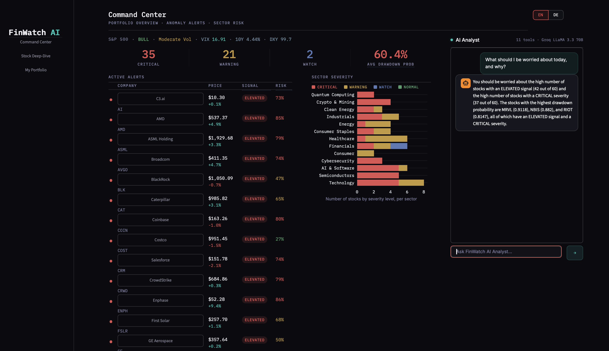
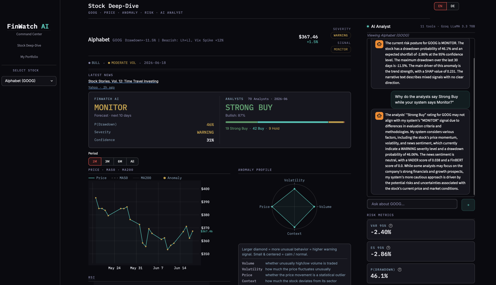

# FinWatch AI

**AI-powered Financial Risk Assessment & Decision Support System**

> Monitors 58 stocks across 13 sectors and 11 sector ETFs daily — detects anomalies, classifies risk severity, and produces an explainable risk signal for every asset.



---

> **DISCLAIMER — Educational / Research Project**
>
> FinWatch AI is an educational and research project demonstrating ML-based anomaly detection and risk assessment techniques. It is **NOT financial advice** and does **NOT** provide buy, sell, or hold recommendations. It performs no trades and is not a financial service or investment tool.
>
> All signals (FAVORABLE / MONITOR / ELEVATED) describe model-derived **risk posture only**. They reflect what the trained models see in the data — not guidance on what any person should do with any asset. Past model performance does not guarantee future results. Use for research and educational purposes only.

---

## What It Does

Most anomaly detection systems stop at the flag: *"something is unusual here."*  
That is not enough to act on.

FinWatch AI goes further. It answers the question that actually matters after an anomaly is detected:

**Is the price still falling — or has it already bottomed out? How elevated is the risk right now?**

The system produces a concrete, explainable risk signal (`FAVORABLE` / `MONITOR` / `ELEVATED`) for every monitored asset, grounded in:

- Anomaly severity (4-model ensemble)
- Drawdown probability (XGBoost + LightGBM, AUC 0.715, 10-day horizon)
- Market regime (Bull / Bear / Transition)
- Valuation fundamentals (P/E, P/B, revenue growth)
- News sentiment (VADER + Groq LLM contextual scoring)
- Momentum recovery signals

---

## Risk Signals

The dashboard displays three risk-level signals:

| Display Label | Meaning |
|--------------|---------|
| **FAVORABLE** | Lower-risk profile — models see positive or stable conditions |
| **MONITOR** | Mixed or neutral signals — no strong directional risk |
| **ELEVATED** | Elevated risk — models flag significant downside probability |

> Internally, the decision engine uses trading-signal codes (origin of the backtest logic); the product relabels them as risk posture at render time. No pipeline logic was changed.

---

## Tech Stack

| Layer | Technology |
|-------|-----------|
| Data ingestion | Twelve Data API (OHLCV), yfinance (fundamentals), Finnhub (news + analyst ratings) |
| Storage | Parquet (per-ticker), structured `data/` layout |
| Feature engineering | pandas, numpy — 30+ features per ticker |
| Anomaly detection | LSTM Autoencoder (Keras), Isolation Forest (scikit-learn), Z-Score |
| Prediction | XGBoost, LightGBM, Logistic Regression meta-model stacking |
| Explainability | SHAP (TreeExplainer), VADER, Groq LLM contextual scoring (`llama-3.3-70b-versatile`) |
| AI Analyst | Groq SDK direct tool-call loop — `llama-3.3-70b-versatile`, 11 tools |
| Dashboard | Streamlit, 4-screen dark-theme UI, EN/DE language toggle |
| Language | Python 3.11 |

---

## ML Architecture

The system runs an **8-layer modular pipeline**:

| Layer | Name | What it does |
|-------|------|-------------|
| 1 | Data Ingestion | Downloads 10 years of daily OHLCV for all assets via Twelve Data API |
| 2 | Data Quality | Validates schema, detects OHLC violations, gaps, stale prices |
| 3 | Feature Engineering | 30+ features: returns, RSI, momentum, regime, ETF context, price context for LLM |
| 4 | Anomaly Detection | 4-model ensemble → weighted continuous score (0–1) |
| 5 | Prediction + Fundamentals | Drawdown probability + meta-model stacking + valuation signals |
| 6 | Decision Engine | Severity classification + trading signal, regime- and momentum-aware |
| 7 | Explainability + Sentiment | SHAP drivers + VADER + Groq LLM contextual scoring + LLM narrative |
| 8 | Reporting + Dashboard | Streamlit dashboard + audit log + daily management summary |

Layers 3, 4, 5, and 7 are **cached** (see Pipeline Caching below). Layer 6 (Decision) always runs fresh — risk signals must reflect the latest data.

### Anomaly Detection — Ensemble of 4 Models

| Model | Count | Weight | What it detects |
|-------|-------|--------|----------------|
| LSTM Autoencoder | 32 (16 sector groups × 2 volatility regimes) | 0.30 | Temporal sequence anomalies |
| Isolation Forest | 16 (per sector group) | 0.30 | Multivariate outliers |
| Return Z-Score | — | 0.20 | Distribution outliers (±3σ, 20d + 60d window) |
| Sector Z-Score | — | 0.20 | Stock vs. sector peer deviation |

Combined into a single `anomaly_score_weighted` (0–1 continuous) per ticker per day.

### Prediction — XGBoost + Meta-Model Stacking

- **Target:** P(max drawdown > 5% over next 10 days)
- **Model:** XGBoost + LightGBM (best model selected automatically at training time)
- **AUC:** 0.715 on holdout set (2024–2026, unseen during training)
- **Meta-model:** Logistic Regression stacking — combines `p_drawdown` + anomaly signals + VIX into `p_drawdown_meta`

### Decision Engine — Severity + Risk Signal

**Severity classification** (priority-ordered rules):

| Priority | Condition | Severity |
|----------|-----------|----------|
| 1 | `p_drawdown ≥ threshold` AND anomaly confirmed bearish (`anomaly_score ≥ 0.30` AND at least one of: `excess_return < 0`, `momentum_5 < −0.02`, `drawdown < threshold × 0.5`) | CRITICAL |
| 2 | Actual drawdown ≤ dynamic threshold (~−15% at average volatility) | CRITICAL |
| 3 | `p_drawdown ≥ warning threshold` | WARNING |
| 4 | Actual drawdown ≤ warning threshold | WARNING |
| 5 | `anomaly_score ≥ 0.20` OR moderate `p_drawdown` | WATCH |
| 6 | `p_drawdown < 30%` + RSI < 70 + positive momentum | POSITIVE_SIGNAL |

VIX-aware: thresholds are raised at low VIX (< 20) to reduce false positives in calm markets.

**Risk signal** — momentum-recovery aware:

For `WARNING` severity, the system distinguishes between stocks still declining vs. those actively recovering:
- Strong ML signal (`p_dd ≥ 0.50` or `anomaly_score ≥ 0.35`) + **no recovery** → **ELEVATED**
- Strong ML signal + **recovering** (`momentum_5 > 0.03` or RSI bullish divergence) → **MONITOR**
- Weak ML signal (neither condition met) → **MONITOR** regardless of momentum

Valuation gates: blocks **FAVORABLE** on negative or extreme P/E (> 50); strengthens the favorable signal on cheap fundamentals.

---

## Backtesting Results

Walk-forward setup — no lookahead bias. 4-year rolling train window, 6-month test windows.

| Signal | Avg 20d Return | Drawdown Rate |
|--------|----------------|---------------|
| FAVORABLE | +3.37%    | 17%           |
| MONITOR   | +2.94%    | 26%           |
| ELEVATED  | +3.79%    | 36%           |

Risk ordering is correct: `ELEVATED` signals carry the highest drawdown rate, `FAVORABLE` the lowest. The system correctly identifies which situations are most dangerous.

---

## Key Design Decisions

**Why an ensemble of 4 anomaly detectors?**  
Each model has different blind spots. LSTM captures temporal patterns, Isolation Forest finds multivariate outliers, Z-Score catches distribution extremes. The ensemble is more robust than any single model.

**Why not just use the anomaly score to trigger ELEVATED?**  
An anomaly means something unusual happened — not that the price is still falling. A stock can spike down and immediately recover. The prediction layer (drawdown probability) adds the time dimension: *will this continue?*

**Why momentum-aware ELEVATED logic?**  
Early testing showed 46 stocks triggering ELEVATED even when prices had already recovered. By gating ELEVATED on both strong ML conviction (`p_dd ≥ 0.50`) and absence of recovery momentum, the signal count dropped from 46 to 34 — with qualitatively better signal quality.

**Why SHAP + LLM?**  
SHAP tells you *which features* drove the model decision. The LLM (Groq / `llama-3.3-70b-versatile`) translates that into plain English for non-technical stakeholders, grounded strictly on model outputs to avoid hallucination. The same model is used for both narrative generation and the AI Analyst agent.

---

## Dashboard

Four-screen Streamlit app (dark theme, custom CSS, EN/DE language toggle):

### Command Center


Landing screen. Shows portfolio-wide state at a glance:
- **Regime banner** — S&P 500 market regime (Bull/Bear/Neutral) + volatility regime (Low/Moderate/High), derived from MA200 and VIX
- **KPI strip** — live counts of CRITICAL / WARNING / WATCH alerts + average drawdown probability
- **Alert list** — all monitored stocks, severity-sorted, with FAVORABLE / MONITOR / ELEVATED signal column; click any row to navigate to Deep-Dive
- **Sector severity bar** — stacked horizontal bar showing CRITICAL/WARNING/WATCH/NORMAL counts per sector

### Stock Deep-Dive
Per-stock analysis view:
- Price chart with MA50, MA200, and anomaly markers
- Metric cards: VaR 95%, Expected Shortfall, P(Drawdown), Model Confidence
- SHAP feature importance bar chart (human-readable labels)
- Anomaly radar chart (volume / volatility / price / context scores)
- LLM narrative: plain-English explanation of the anomaly and signal rationale
- **AI Analyst chat panel** (right column) — ask questions about the selected stock

### AI Analyst
The AI Analyst is embedded as a chat panel in the Deep-Dive and Command Center screens. It uses the **Groq Python SDK** (direct tool-call loop with `llama-3.3-70b-versatile`) — not LlamaIndex. The agent:

- Runs a synchronous tool-call loop (up to 8 iterations) until the model provides a final answer
- Shows tool-call chips in the UI as each tool fires
- Is scoped to the currently selected ticker in Deep-Dive (only that ticker's data is sent, minimizing token usage)
- Resets chat history when the ticker changes
- Always reports risk posture (FAVORABLE / MONITOR / ELEVATED), never raw trading-action terms

| Tool | What it returns |
|------|----------------|
| `get_stock_analysis` | Severity, signal, drawdown probability, anomaly type, confidence |
| `get_risk_metrics` | VaR 95%, ES 95%, ES ratio, max drawdown 30d |
| `explain_anomaly` | SHAP drivers, anomaly group scores, narrative text |
| `get_market_context` | Regime, vol regime, market-wide flag, context summary |
| `get_news_sentiment` | VADER score, Groq LLM contextual score, LLM news summary, top headlines |
| `get_trend_analysis` | MA50/200, momentum, RSI, volume trend |
| `get_portfolio_overview` | Severity + signal distribution across all stocks |
| `get_sector_analysis` | Per-sector severity counts + avg drawdown probability |
| `get_macro_context` | 10Y Treasury yield, Dollar Index, VIX + rate/dollar/VIX environment labels |
| `get_earnings_calendar` | Upcoming earnings dates for monitored stocks (next 30 days) |
| `get_correlation_risk` | Avg portfolio correlation, high-corr peers, concentration risk level |

### My Portfolio
Personal position tracker: add holdings, view P&L, and see which positions carry active risk signals.

---

## Setup

### 1. Create virtual environment

```bash
python3.11 -m venv .venv
source .venv/bin/activate
pip install -r requirements.txt
```

### 2. Configure API keys

Create a `.env` file in the project root:

```env
GROQ_API_KEY=your_groq_key_here
FINNHUB_API_KEY=your_finnhub_key_here
TWELVE_DATA_API_KEY=your_twelvedata_key_here
```

All three keys are required:
- **Groq** — LLM narrative generation + AI Analyst agent (free tier at console.groq.com)
- **Finnhub** — news headlines + analyst ratings per ticker (free tier at finnhub.io)
- **Twelve Data** — OHLCV price data (free Basic tier at twelvedata.com)

### 3. Train models (first time only)

```bash
python src/prediction/models/drawdown_probability.py   # XGBoost + LightGBM drawdown model
python src/detection/isolation_forest.py               # Isolation Forest × 16 sector groups
python src/detection/lstm_autoencoder.py               # LSTM Autoencoder × 32 models (16 groups × 2 volatility regimes)
python src/prediction/models/meta_model.py             # Meta-model stacking layer
python src/backtesting/backtest.py                     # Walk-forward backtest + signal precision
```

> Models are **not retrained** on every pipeline run — only predictions are made.  
> Retrain recommendation: Drawdown model monthly, Isolation Forest every 3–6 months, LSTM Autoencoder every 6 months, Meta-model after each Drawdown retrain.

### 4. Optional: fetch analyst ratings

```bash
python src/data/analyst_ratings.py
```

Pulls Finnhub recommendation trends (Strong Buy / Buy / Hold / Sell) for all monitored tickers and saves to `data/analyst_ratings.parquet`.

### 5. Daily pipeline

```bash
python src/pipeline.py
```

### 6. Dashboard

```bash
streamlit run finwatch/app.py
```

---

## Data Sources

| Source | What it provides |
|--------|-----------------|
| Twelve Data API | Daily OHLCV — 10 years historical + incremental daily updates |
| Finnhub | News headlines — last 7 days per ticker; analyst recommendation trends |
| yfinance | Fundamentals — P/E, P/B, revenue growth, insider activity, options flow |
| FRED (via pandas-datareader) | VIX index — used as macro regime signal |

**Universe:** 58 stocks across 13 sectors + 11 sector ETFs + S&P 500 reference index (via SPY proxy — see note below).

### Twelve Data — Rate Limits and Caching

The free **Basic tier** provides:
- 8 API credits per minute
- 800 API credits per day

The loader enforces **8 seconds between every API call** (including retries) to stay within the per-minute limit. On HTTP 429, it waits 65 seconds before retrying once.

**Smart caching**: before each download, the loader checks whether the local parquet file already contains data through the last NYSE trading day (using `pandas_market_calendars`). If yes, the download is skipped entirely — no API credits consumed.

**^SPX note**: the S&P 500 index (`SPX`) is not available on the Twelve Data free tier. The system automatically falls back to **SPY** (S&P 500 ETF) as a proxy. The data is saved as `data/raw/references/^SPX.parquet` so all downstream code works without modification.

---

## Pipeline Caching

Layers 3, 4, 5, and 7 support hash-based caching to avoid recomputing unchanged layers.

**Cache key** = sha256(input parquet fingerprints | source code hash | upstream layer hash)

A layer is skipped if its cache key matches the stored key from the last run. Any change in input data, source code, or an upstream layer automatically invalidates the cache and all downstream layers.

Cache entries are stored in `data/cache/` as JSON files (one per layer).

### CLI flags

```bash
# Normal run — uses cache wherever valid
python src/pipeline.py

# Force full recompute — bypass all caches
python src/pipeline.py --force

# Recompute from layer N onward (N = 3, 4, 5, or 7)
python src/pipeline.py --force-layer 5
```

Layer 6 (Decision) is **never cached** — risk signals must always be fresh.

---

## Dependencies

Key pinned versions and reasons:

| Package | Version | Why pinned |
|---------|---------|-----------|
| `numpy` | `==1.26.4` | Required by `tensorflow-macos==2.16.2`; numpy 2.x breaks TF |
| `matplotlib` | `==3.8.3` | Requires numpy < 2 |
| `pyarrow` | `==15.0.0` | Stable parquet read/write with pandas 2.2.1 |
| `shap` | `==0.49.1` | Last version without `numpy>=2` requirement; includes XGBoost 3.x compatibility via runtime shim |
| `pandas` | `==2.2.1` | Stable; pandas 3.x changed `groupby().apply()` behavior in breaking ways |
| `tensorflow-macos` | `==2.16.2` | Apple Silicon TF; version must match `tensorflow-metal` |

Full list in `requirements.txt`.

---

## Project Structure

```
ai-Anomaly_detection-system/
├── .env                             # API keys (never committed)
├── config/assets.yaml               # Tickers, sectors, ETF mappings
├── requirements.txt
├── src/
│   ├── pipeline.py                  # Main entry point (supports --force / --force-layer N)
│   ├── agent/                       # AI Analyst agent
│   │   ├── agent.py                 # Groq SDK direct tool-call loop (llama-3.3-70b-versatile)
│   │   └── tools.py                 # 11 agent tools (analysis, risk, macro, earnings, correlation, …)
│   ├── cache/                       # Pipeline cache manager
│   │   └── cache_manager.py
│   ├── data/                        # Data adapters + collectors
│   │   ├── twelve_data_loader.py    # Twelve Data API adapter
│   │   └── analyst_ratings.py       # Finnhub analyst recommendation fetcher
│   ├── ingestion/                   # Download + fundamental collectors
│   │   ├── download_historical.py
│   │   ├── earnings_collector.py
│   │   ├── insider_collector.py
│   │   ├── options_collector.py
│   │   ├── sentiment_collector.py
│   │   └── valuation_collector.py
│   ├── quality/                     # Data quality validation
│   ├── features/                    # Feature engineering (basic / context / advanced)
│   ├── detection/                   # Anomaly detection (LSTM-AE, IF, Z-Score)
│   ├── prediction/                  # Drawdown model, meta-model, ES, OBV
│   ├── decision/                    # Severity + risk signal logic
│   ├── explainability/              # SHAP, VADER, Groq contextual scoring + narrator
│   ├── reporting/                   # Audit log, daily report
│   └── backtesting/                 # Walk-forward backtesting
├── finwatch/                        # Streamlit dashboard package
│   ├── app.py                       # Entry point — routing, sidebar, global CSS
│   ├── data/
│   │   ├── loader.py                # Shared data loaders (COMPANY_NAMES, SECTORS, SIGNAL_DISPLAY, …)
│   │   └── portfolio.py             # Portfolio persistence
│   └── ui/
│       ├── command_center.py        # Screen 1: regime banner, KPI strip, alert list
│       ├── deep_dive.py             # Screen 2: per-stock analysis, SHAP, radar, chart
│       ├── ai_analyst.py            # Screen 3: standalone AI Analyst page
│       ├── chat_panel.py            # Embedded AI Analyst chat panel (Deep-Dive + Command Center)
│       ├── portfolio_page.py        # Screen 4: position tracker + P&L
│       ├── theme.py                 # FEATURE_LABELS / ANOMALY_LABELS + helper fns
│       ├── glossary.py              # Tooltip term definitions
│       ├── i18n.py                  # EN/DE string table + t() helper
│       ├── charts.py                # Shared Plotly chart helpers
│       └── components.py            # Shared UI components
├── data/
│   ├── raw/                         # Downloaded OHLCV parquets
│   ├── features/                    # Engineered feature parquets
│   ├── detection/                   # Anomaly score parquets
│   ├── decisions/                   # Severity + signal output parquets
│   ├── explanations/                # SHAP + narrative parquets
│   ├── news/                        # News headline parquets
│   ├── analyst_ratings.parquet      # Finnhub analyst consensus (optional)
│   └── cache/                       # Layer cache fingerprints (auto-generated)
├── models/                          # Trained model files (.pkl, .keras)
└── ARCHITECTURE.md                  # Full technical architecture
```

---

## Scope

This is a **monitoring and decision-support framework** for research and educational use — not a trading bot and not investment advice. It runs on daily OHLCV data and is designed to demonstrate how ML-based anomaly detection and risk classification can be applied to financial time series.

Its signals operate on a days-to-weeks horizon (driven by a 10-day drawdown model) — positioning it as an early-warning triage layer for active monitoring, not a long-term valuation tool or an intraday trading system.

---

## Planned

- Real-time / intraday data (1h candles)
- Alert delivery via email or Slack
- Expanded universe (international markets, crypto)
